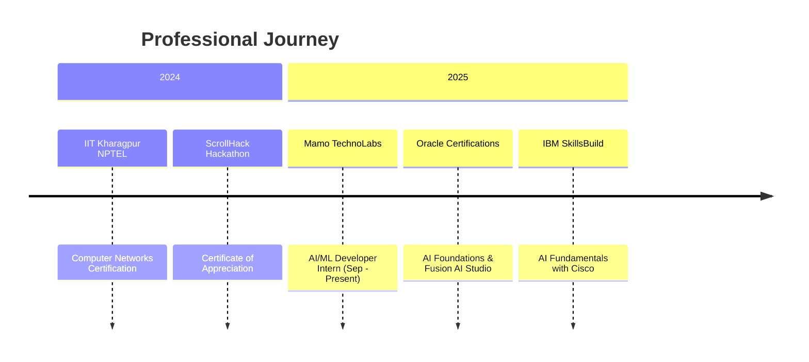

<div align="center">

<!-- Dynamic Header -->


<!-- Typing Animation -->


<br/>

<!-- Social Badges with Icons -->
[](https://linkedin.com/in/ravishankar-gharabidi-35bb2b262)
[](mailto:rgharabidi@gmail.com)
[](https://github.com/Ravi19092004)
[](#)

<br/>

<!-- Profile Views & Followers -->

[](https://github.com/Ravi19092004?tab=followers)

</div>

---

## 👨‍💻 About Me


I'm a passionate **AI/ML Developer** and **Full-Stack Engineer** with a knack for building intelligent systems that make a difference. Currently pursuing BTech in Computer Science with AI specialization at Parul Institute of Technology, I transform complex challenges into elegant, scalable solutions.

**Currently:**
- 🔬 Working as **AI/ML Developer Intern** @ Mamo TechnoLabs
- 🎓 Pursuing **BTech CSE (AI)** @ Parul Institute of Technology
- 🌱 Learning **Advanced ML Models, Cloud Architecture, System Design**
- 💡 Building **AI-powered applications** and **full-stack solutions**
- 📍 Based in **Boisar, Maharashtra, India** 🇮🇳

**Quick Facts:**
```javascript
const ravishankar = {
  pronouns: "He/Him",
  code: ["JavaScript", "TypeScript", "Python", "Java"],
  askMeAbout: ["Web Dev", "AI/ML", "Cloud", "Cybersecurity"],
  technologies: {
    frontEnd: ["React", "Next.js", "Vue.js", "TailwindCSS"],
    backEnd: ["Node.js", "Express", "Django", "Flask"],
    databases: ["MongoDB", "PostgreSQL", "MySQL", "Redis"],
    aiMl: ["TensorFlow", "PyTorch", "Scikit-learn", "Pandas"],
    devOps: ["Docker", "AWS", "GCP", "CI/CD"],
  },
  currentFocus: "Building production-ready AI/ML applications",
  funFact: "I debug with coffee and code with curiosity ☕💻"
};
```

<br clear="right"/>

---

## 🚀 Tech Stack & Tools

<div align="center">

### 💻 Languages


### 🎨 Frontend Development


### ⚙️ Backend Development


### 🤖 AI/ML & Data Science


### 🗄️ Databases


### ☁️ Cloud & DevOps


### 🛠️ Tools & Others


</div>

---

## 📊 GitHub Analytics

<div align="center">

### 📈 My GitHub Journey

| Metric | Details |
|--------|---------|
| 🎯 **Total Repositories** | 10+ Projects |
| ⭐ **Total Stars** | Growing Daily |
| 📝 **Contributions** | Active & Consistent |
| 👥 **Followers** | Building Community |
| 🔥 **Current Streak** | Coding Every Day |
| 💻 **Top Languages** | JavaScript, Python, TypeScript |

<br/>

### 🔗 View Live Stats

**Visit my profile for real-time statistics:** [github.com/Ravi19092004](https://github.com/Ravi19092004)

<br/>

### 📅 Recent Activity

```
🟢 Active Contributor
📊 Regular Commits
🚀 Building AI/ML Projects
💡 Open Source Enthusiast
```

</div>

---


<!-- Contribution Graph -->


</div>

---

## 🌟 Featured Projects

<div align="center">

<table>
<tr>
<td width="50%" valign="top">

### 🔐 Authentication Service Provider

**Tech Stack:** Next.js • NextAuth.js • Prisma • PostgreSQL

Comprehensive authentication service with OAuth providers (Google, GitHub), email verification, role-based access control, and secure session management.

**Key Features:**
- 🔒 Multiple OAuth providers
- ✉️ Email verification system
- 👥 Role-based access control
- 🔐 Secure password hashing
- 📱 Responsive design

[](https://github.com/Ravi19092004/Authentication-Service-Provider)

</td>
<td width="50%" valign="top">

### 🛒 JasnMart E-Commerce Platform

**Tech Stack:** MERN Stack • Stripe • Redis • JWT

Full-featured e-commerce platform with shopping cart, payment integration, coupon system, and comprehensive admin dashboard with analytics.

**Key Features:**
- 🛍️ Product catalog & search
- 💳 Stripe payment integration
- 🎟️ Coupon system
- 📊 Admin analytics dashboard
- 🚀 Redis caching

[](https://github.com/Ravi19092004/JasnMart)

</td>
</tr>

<tr>
<td width="50%" valign="top">

### 🛡️ DataShield - AI Phishing Detector

**Tech Stack:** React • TypeScript • Machine Learning • REST API

AI-powered cybersecurity tool for real-time phishing detection with URL scanning, trust score analysis, and comprehensive threat reporting.

**Key Features:**
- 🤖 AI-powered detection
- 🔍 Real-time URL scanning
- 📊 Trust score analysis
- 🎨 Cyber-themed UI
- 📱 Responsive design

[](https://github.com/Ravi19092004/DataShield-Frontend)

</td>
<td width="50%" valign="top">

### 🏪 RaviStore - Modern E-Commerce

**Tech Stack:** PERN Stack (PostgreSQL • Express • React • Node.js)

Modern e-commerce platform with complete product management, user authentication, shopping cart functionality, and order tracking.

**Key Features:**
- 📦 Product management
- 🔐 User authentication
- 🛒 Shopping cart
- 📋 Order tracking
- 💼 Admin panel

[](https://github.com/Ravi19092004/ravistore)

</td>
</tr>
</table>

</div>

---

## 🏆 Certifications & Achievements

<div align="center">

<table>
<tr>
<td align="center" width="33%">
<br/>
<b>Oracle Cloud Infrastructure</b><br/>
<sub>2025 AI Foundations Associate</sub>
</td>
<td align="center" width="33%">
<br/>
<b>Fusion AI Studio</b><br/>
<sub>Foundations Associate - Rel 1</sub>
</td>
<td align="center" width="33%">
<br/>
<b>AI Fundamentals</b><br/>
<sub>IBM SkillsBuild - Cisco Academy</sub>
</td>
</tr>
<tr>
<td align="center" width="33%">
<br/>
<b>Computer Networks</b><br/>
<sub>IIT Kharagpur</sub>
</td>
<td align="center" width="33%">
<br/>
<b>ScrollHack</b><br/>
<sub>Certificate of Appreciation</sub>
</td>
<td align="center" width="33%">
<br/>
<b>Coming Soon</b><br/>
<sub>AWS & GCP Certifications</sub>
</td>
</tr>
</table>

</div>

---

## 💼 Professional Experience

<div align="center">



</div>

### 🔬 AI/ML Developer Intern @ Mamo TechnoLabs
**Sep 2025 - Present | Vadodara, Gujarat**

- 🤖 Developing and deploying machine learning models for real-world applications
- 📊 Processing and analyzing large datasets for model training and validation
- ☁️ Implementing cloud-based ML solutions using AWS and GCP
- 🔧 Collaborating with cross-functional teams on AI-powered product features
- 📈 Optimizing model performance and deployment pipelines

**Technologies Used:** Python, TensorFlow, PyTorch, Scikit-learn, AWS, Docker, Git

---

## 📈 What I'm Currently Working On

<div align="center">

| Project | Progress | Description |
|---------|----------|-------------|
| 🎨 **Personal Portfolio** | `███████████████░░░░░ 75%` | Building a stunning portfolio with Next.js & Three.js |
| 🤖 **AI Code Assistant** | `████████████░░░░░░░░ 60%` | AI-powered code assistant with GPT-4 integration |
| 🔧 **Developer Toolkit** | `████████░░░░░░░░░░░░ 40%` | Comprehensive toolkit for developers |

</div>

---

## 🎯 2025 Goals & Focus Areas

<div align="center">

| Goal | Progress | Target |
|------|----------|--------|
| 🚀 **Open Source Contributions** | `██████░░░░░░░░░░░░░░ 30%` | 10+ Projects |
| 🤖 **AI/ML Applications** | `████████░░░░░░░░░░░░ 40%` | 5 Production Apps |
| ☁️ **Cloud Certifications** | `████░░░░░░░░░░░░░░░░ 20%` | AWS + GCP |
| 📝 **Technical Blogs** | `██░░░░░░░░░░░░░░░░░░ 10%` | 20+ Articles |
| 🎓 **System Design Mastery** | `██████████░░░░░░░░░░ 50%` | Advanced Level |

</div>

**Current Focus:**
- 🔥 Building production-ready ML models with TensorFlow & PyTorch
- 🌐 Developing scalable full-stack applications with modern frameworks
- 🔒 Exploring cybersecurity and penetration testing
- ☁️ Mastering cloud architecture patterns and microservices
- 📚 Contributing to open-source AI/ML projects

---

## 🎨 Skills Visualization

<div align="center">

```javascript
const skillLevels = {
  "AI/ML": "████████████████████░ 95%",
  "Full-Stack Development": "███████████████████░░ 90%",
  "Cloud & DevOps": "████████████████░░░░░ 80%",
  "Database Management": "█████████████████░░░░ 85%",
  "System Design": "███████████████░░░░░░ 75%",
  "Cybersecurity": "██████████████░░░░░░░ 70%",
  "UI/UX Design": "█████████████░░░░░░░░ 65%"
};
```

</div>

---

## 📝 Latest Blog Posts

<!-- BLOG-POST-LIST:START -->
- 🤖 Building Production-Ready ML Models: Best Practices
- 🚀 Scaling Full-Stack Applications with Microservices
- 🔒 Implementing Zero-Trust Security in Modern Web Apps
- ☁️ Cloud Architecture Patterns for AI/ML Workloads
- 📊 Data Pipeline Optimization: From ETL to Real-Time Processing
<!-- BLOG-POST-LIST:END -->

---

## 💡 Let's Connect & Collaborate!

<div align="center">

I'm always excited to collaborate on innovative projects! Here's what I'm particularly interested in:

<table>
<tr>
<td align="center" width="25%">
<br/>
<b>AI/ML Projects</b><br/>
<sub>Neural Networks<br/>NLP, Computer Vision</sub>
</td>
<td align="center" width="25%">
<br/>
<b>Full-Stack Apps</b><br/>
<sub>MERN/PERN Stack<br/>Scalable Solutions</sub>
</td>
<td align="center" width="25%">
<br/>
<b>Cloud Solutions</b><br/>
<sub>AWS, GCP<br/>Serverless, Containers</sub>
</td>
<td align="center" width="25%">
<br/>
<b>Cybersecurity</b><br/>
<sub>Penetration Testing<br/>Secure Applications</sub>
</td>
</tr>
</table>

<br/>

### 📫 Reach Out To Me

<a href="https://linkedin.com/in/ravishankar-gharabidi-35bb2b262">
  
</a>
<a href="mailto:rgharabidi@gmail.com">
  
</a>
<a href="https://github.com/Ravi19092004">
  
</a>
<a href="tel:+918080255989">
  
</a>

<br/><br/>

### ⚡ "Code is poetry written in logic, and I'm here to write masterpieces"

<br/>

</div>

---

<div align="center">

### 💖 Thank you for visiting my profile!

**Let's build something amazing together!**

**Open to collaborations and opportunities • Feel free to reach out!**

**If you find my work interesting, don't forget to ⭐ star my repositories!**

<br/>

<!-- Footer Wave -->


</div>
